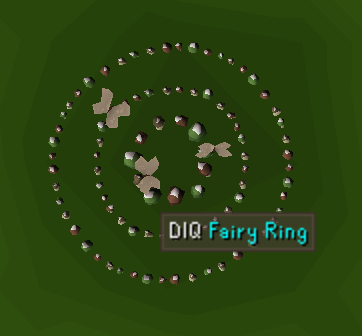
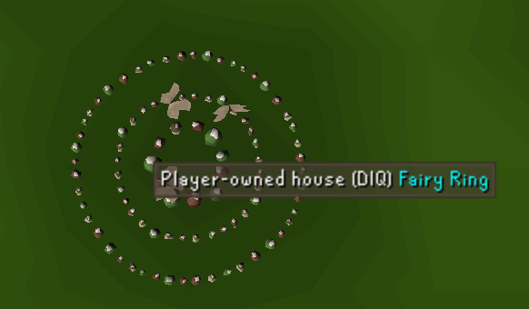
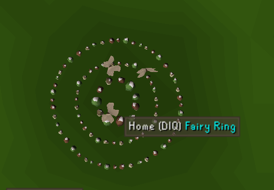
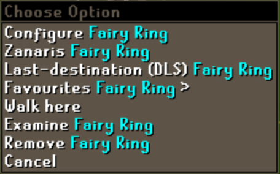
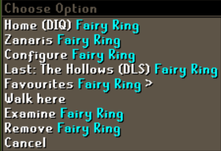
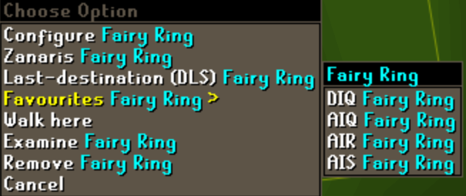
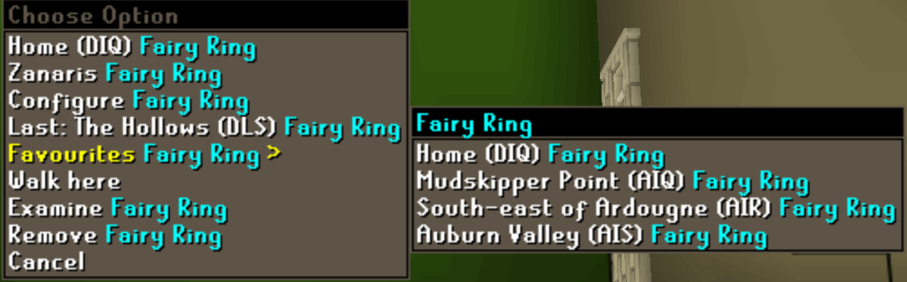
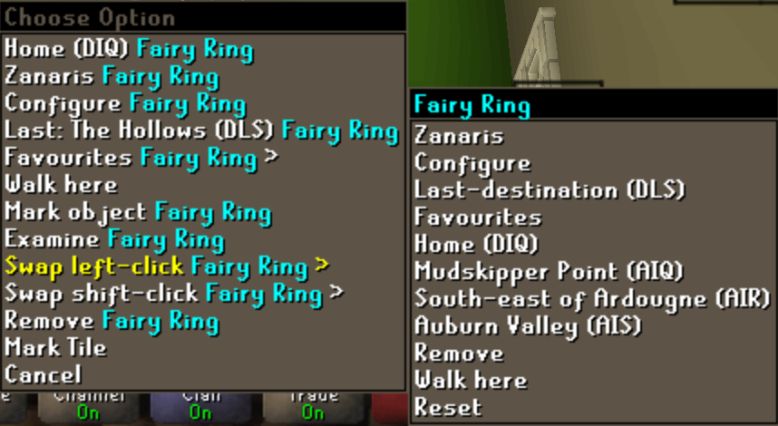
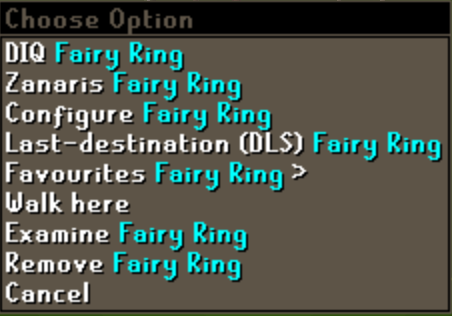
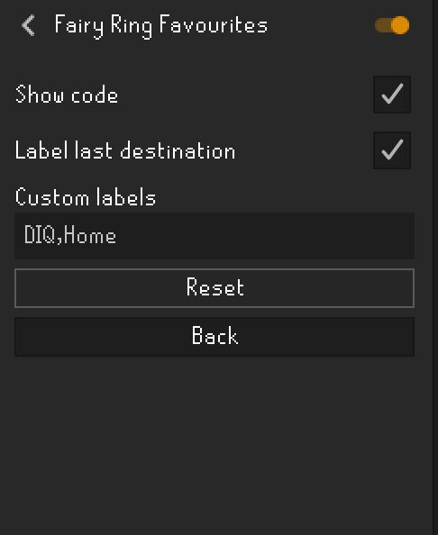

# Fairy Ring Favourites

Labels favourite fairy ring teleports with destination names instead of cryptic codes.

## Before / After

### Hover
| Before | After | After (custom name) |
|--------|-------|---------------------|
|  |  |  |

### Right-click menu
| Before | After |
|--------|-------|
|  |  |

### Favourites submenu
| Before | After |
|--------|-------|
|  |  |

### Swap left-click / shift-click submenu
| Before | After |
|--------|-------|
|  |  |

### Swapped left-click
| Before | After |
|--------|-------|
|  |  |

## Configuration



## Features

- Replaces fairy ring codes (e.g. `BLP`, `AIQ`) with destination names in:
  - Favourites submenu
  - Swap left-click / shift-click submenus
  - Top-level swapped menu entries
  - Last-destination entry
- All 52 fairy ring destinations have built-in default names
- Fully customisable labels per code

## Settings

| Setting | Description | Default |
|---------|-------------|---------|
| **Show code** | Appends the code after the name, e.g. `TzHaar area (BLP)` | On |
| **Label last destination** | Also labels the `Last-destination (CODE)` menu entry | On |
| **Custom labels** | Override destination names (see below) | Empty |

## Custom Labels

Override any destination name by adding one entry per line in the format:

```
CODE,Label
```

### Examples

```
BLP,Tzhaar
DKR,GE
AIQ,Mudskip
CIR,Farming
BJS,Zulrah
```

With **Show code** enabled, `BLP` would display as `Tzhaar (BLP)`.
With **Show code** disabled, it would display as just `Tzhaar`.

### Default Names

If no custom label is set, the plugin uses built-in short destination names. For the full list, see [FairyRingDestination.java](src/main/java/com/github/h1pstr/fairyringfavourites/FairyRingDestination.java).
